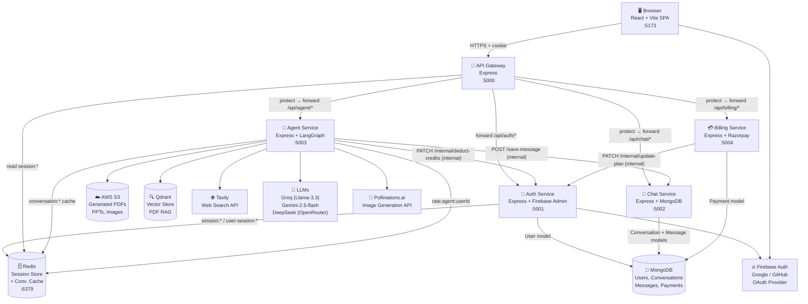

# CortexAI — System Overview

CortexAI is an AI-powered chat platform that lets users invoke specialized AI agents (chat, web search, code generation, PDF/PPT generation, image generation, and document vision) through a single web interface. The backend is a Node.js microservices system sitting behind an API gateway, with a React/Vite SPA on the frontend.

---

## Architecture Diagram



---

## Services at a Glance

| Service | Location | Port | One-line Description |
|---------|----------|------|---------------------|
| **API Gateway** | `backend/gateway/` | 5000 | Single entry point; validates sessions, proxies to downstream services |
| **Auth Service** | `backend/services/auth/` | 5001 | Verifies Firebase ID tokens, issues Redis session cookies, manages user records and credits |
| **Chat Service** | `backend/services/chat/` | 5002 | Persists conversations and messages to MongoDB |
| **Agent Service** | `backend/services/agent/` | 5003 | LangGraph supervisor that routes prompts to 8 specialized sub-agents |
| **Billing Service** | `backend/services/billing/` | 5004 | Creates Razorpay orders, verifies payments, triggers plan upgrades on the Auth service |
| **Frontend** | `frontend/` | 5173 | React + Vite SPA; Redux state, Firebase Auth, Razorpay checkout widget |

### Agent Sub-agents (inside Agent Service)

| Agent | File | Trigger |
|-------|------|---------|
| `chat` | `agents/chat.agent.js` | Default / general questions |
| `search` | `agents/search.agent.js` | Current events, internet lookup → then passes to `chat` |
| `coding` | `agents/coding.agent.js` | Code generation, review, debugging |
| `pdf` | `agents/pdf.agent.js` | "Generate a PDF about…" |
| `ppt` | `agents/ppt.agent.js` | "Create a presentation about…" |
| `image` | `agents/imageGen.agent.js` | Image generation requests |
| `vision` | `agents/vision.agent.js` | User uploads an image file |
| `pdf_rag` | `agents/pdfRag.agent.js` | User uploads a PDF file |

---

## Tech Stack Per Component

### API Gateway (`backend/gateway/`)
| Concern | Library |
|---------|---------|
| HTTP server | `express` |
| Reverse proxy | `express-http-proxy` |
| Session validation | `ioredis` (reads Redis `session:*` keys) |
| Security | `helmet`, `cors`, `cookie-parser` |

### Auth Service (`backend/services/auth/`)
| Concern | Library |
|---------|---------|
| HTTP server | `express` |
| OAuth token verification | `firebase-admin` |
| Database | `mongoose` (MongoDB) |
| Session store | `ioredis` (Redis) |
| Crypto | Node built-in `crypto` (UUID for session IDs) |

### Chat Service (`backend/services/chat/`)
| Concern | Library |
|---------|---------|
| HTTP server | `express` |
| Database | `mongoose` (MongoDB) |

### Agent Service (`backend/services/agent/`)
| Concern | Library |
|---------|---------|
| HTTP server | `express` |
| Agentic framework | `@langchain/langgraph` |
| LLM — general/search/image | `@langchain/groq` (Llama-3.3-70b-versatile) |
| LLM — coding | `@langchain/openrouter` (DeepSeek-Chat) |
| LLM — vision | `@langchain/google-genai` (Gemini-2.5-flash) |
| Embeddings | `@langchain/google-genai` (gemini-embedding-001) |
| Web search | `@langchain/tavily` |
| Vector store | `@langchain/qdrant` (Qdrant cloud) |
| File uploads | `multer` (disk storage, `temp/` dir) |
| PDF generation | `pdfkit` |
| PPT generation | `pptxgenjs` |
| PDF parsing (RAG) | `pdf-parse` + `@langchain/textsplitters` |
| Object storage | `@aws-sdk/client-s3` (S3 presigned URLs) |
| Image generation | Pollinations.ai REST API (via `axios`) |
| Rate limiting | `ioredis` (Redis sliding window) |
| Session cache | `ioredis` (Redis) |

### Billing Service (`backend/services/billing/`)
| Concern | Library |
|---------|---------|
| HTTP server | `express` |
| Payment provider | `razorpay` |
| Database | `mongoose` (MongoDB) |
| Signature verification | Node built-in `crypto` (HMAC-SHA256) |

### Frontend (`frontend/`)
| Concern | Library |
|---------|---------|
| Framework | React 18 + Vite |
| Routing | `react-router-dom` |
| State management | Redux Toolkit (`@reduxjs/toolkit`) |
| HTTP client | `axios` (with `withCredentials: true`) |
| Firebase Auth | `firebase/auth` (Google + GitHub providers) |
| Code editor | `@monaco-editor/react` |
| Animations | `framer-motion` |
| Icons | `lucide-react`, `react-icons` |
| Payment widget | Razorpay JS SDK (loaded from CDN) |

### Shared Infrastructure
| Component | Details |
|-----------|---------|
| **Redis** | Single instance (Docker: `redis:latest`, port 6379) used by gateway, auth service, and agent service |
| **MongoDB** | Separate databases per service (auth, chat, billing) |
| **AWS S3** | Single bucket for PDFs, PPTs, and generated images |
| **Qdrant** | Cloud-hosted vector DB used exclusively by `pdfRag.agent.js` |

---

## Port Map (local development)

```
:5000  API Gateway     (all client traffic)
:5001  Auth Service
:5002  Chat Service
:5003  Agent Service
:5004  Billing Service
:5173  Frontend (Vite dev server)
:6379  Redis
```

---

## Gotchas / Things to Know

- **Auth routes are NOT protected at the gateway.** `POST /api/auth/login` and `GET /api/auth/logout` are forwarded directly via `express-http-proxy` without passing through the `protect` middleware. All other routes (`/api/chat`, `/api/agent`, `/api/billing`) require a valid Redis session cookie.
- **Inter-service calls bypass the gateway.** The agent service calls `AUTH_SERVICE` and `CHAT_SERVICE` directly via `axios` using env-var URLs. Similarly, the billing service calls `AUTH_SERVICE` directly. This means the gateway's `protect` middleware is **not** invoked for these internal calls.
- **No `.env` at the root.** Each service has its own `.env` file. There is no monorepo-level environment configuration; port values, DB URLs, and API keys must be set individually per service.
- **Docker Compose is minimal.** The `docker-compose.yml` only starts Redis. All other services are started manually with `npm run dev` or equivalent.
- **Firebase config in `frontend/firebase.js` is partially commented out** (`authDomain`, `projectId`, `storageBucket`, `messagingSenderId`, `appId` are all commented out). Firebase may not function correctly with only `apiKey` set.
- **Session cookie is `secure: false`** — this is development-only. Must be changed to `true` before any HTTPS deployment.
