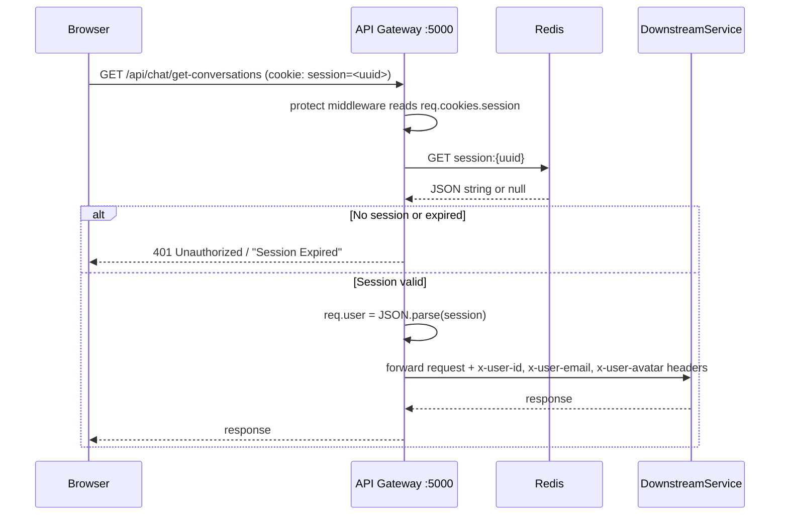

# Auth Service — Authentication & Authorization

The auth service is the identity backbone of CortexAI. It delegates OAuth token verification to Firebase Admin SDK, then issues its own stateful Redis-backed session cookies that the API gateway validates on every protected request.

**Location:** `backend/services/auth/`  
**Entry point:** `backend/services/auth/index.js`  
**Port:** `5001` (configured via `process.env.PORT`)

---

## Overview: How Identity Works in CortexAI

CortexAI does **not** use JWTs internally. The authentication flow is:

1. Firebase handles OAuth on the frontend (Google / GitHub popup).
2. Firebase returns a short-lived **ID token** to the browser.
3. The browser sends this token to the auth service's `/login` endpoint.
4. The auth service **verifies** the token with Firebase Admin and then creates a **server-side session** in Redis.
5. A `session` HTTP-only cookie (containing the session UUID) is set on the browser.
6. All subsequent API calls send this cookie; the **gateway** reads it from Redis to authenticate the request.

---

## Step-by-Step: Login Flow

```mermaid
sequenceDiagram
    participant Browser
    participant FirebaseAuth as Firebase Auth (Google)
    participant Frontend
    participant Gateway as API Gateway :5000
    participant AuthService as Auth Service :5001
    participant MongoDB
    participant Redis

    Browser->>FirebaseAuth: signInWithPopup(googleProvider)
    FirebaseAuth-->>Browser: Firebase User + ID Token
    Browser->>Frontend: result.user.getIdToken()
    Frontend->>Gateway: POST /api/auth/login  { token }
    Gateway->>AuthService: forward (no protect middleware)
    AuthService->>FirebaseAuth: getAuth(app).verifyIdToken(token)
    FirebaseAuth-->>AuthService: decoded { uid, email, name, picture, sign_in_provider }
    AuthService->>MongoDB: User.findOne({ firebaseUid: uid })
    alt New user
        AuthService->>MongoDB: User.create({ firebaseUid, email, name, avatar, provider })
    end
    AuthService->>Redis: SET user-session:{userId}  =  sessionId  EX 604800
    AuthService->>Redis: SET session:{sessionId}  =  JSON(userId,email,avatar,name,plan,credits,totalCredits)  EX 604800
    AuthService-->>Gateway: Set-Cookie: session={sessionId}; HttpOnly
    Gateway-->>Frontend: { success: true, user: { ... } }
    Frontend->>Redux: dispatch(setUserData(user))
```

### Step breakdown

1. **`Home.jsx` — `handleGoogleLogin()`** calls `signInWithPopup(auth, googleProvider)` from Firebase Client SDK.
2. **Firebase returns** a `result.user` object. `result.user.getIdToken()` is called to get the Firebase ID token (JWT, short-lived ~1 hour, signed by Google).
3. **`Home.jsx` — `login(token)`** posts `{ token }` to `POST /api/auth/login` via the shared axios instance.
4. **Gateway** (`backend/gateway/index.js` line 27) forwards `/api/auth/*` directly via `proxy(process.env.AUTH_SERVICE)` — **no `protect` middleware**.
5. **Auth Service — `login()` controller** (`backend/services/auth/controllers/auth.controllers.js` line 10):
   - Calls `getAuth(app).verifyIdToken(token)` using the Firebase Admin SDK. This performs a cryptographic verification against Google's public keys. The `app` is initialized in `backend/services/auth/config/firebase.js` using `serviceAccount.json`.
   - Looks up (or creates) a `User` document in MongoDB (`backend/services/auth/models/user.model.js`).
6. **Session creation** (lines 56–90 of `auth.controllers.js`):
   - `crypto.randomUUID()` generates a collision-resistant session ID.
   - Two Redis keys are written:
     - `user-session:{userId}` → `sessionId` (used by billing service to find the current session for a given user ID)
     - `session:{sessionId}` → JSON blob with `{ userId, email, avatar, name, plan, credits, totalCredits }` (what the gateway reads on each request)
   - Both keys expire in **7 days** (604800 seconds).
7. **Cookie set**: `res.cookie("session", sessionId, { httpOnly: true, secure: false, sameSite: "lax", maxAge: 604800000 })`. The `maxAge` is 7 days in milliseconds.
8. **Response**: the full `user` MongoDB document is returned to the frontend, which dispatches `setUserData` into Redux.

---

## Step-by-Step: Request Authorization (protect middleware)

Every call to `/api/chat/*`, `/api/agent/*`, and `/api/billing/*` passes through the `protect` middleware **at the gateway**.



**File:** `backend/gateway/middlewares/auth.middleware.js`

1. Reads `req.cookies.session` (requires `cookie-parser` middleware).
2. If missing → `401 { message: "Unauthorized" }`.
3. Calls `redis.get("session:{sessionId}")`. If null (expired or deleted) → `401 { message: "Session Expired" }`.
4. Parses the JSON blob and attaches it to `req.user`.
5. Calls `next()`, which runs `proxyWithUser()`.

**File:** `backend/gateway/utils/proxyWithHeaders.js`  
After the session is validated, `proxyWithUser(serviceUrl)` injects three headers before proxying:
- `x-user-id` → `req.user.userId`
- `x-user-email` → `req.user.email`
- `x-user-avatar` → `req.user.avatar`

Downstream services (`chat`, `agent`, `billing`) read identity **only from these headers** — they never touch Redis or Firebase themselves.

---

## Step-by-Step: Logout Flow

1. **`Sidebar.jsx` — `logout()`** calls `GET /api/auth/logout`.
2. Gateway forwards to auth service.
3. **Auth Service — `logout()` controller** (`auth.controllers.js` line 136):
   - Reads `req.cookies.session`.
   - Calls `redis.del("session:{sessionId}")` — immediately invalidates the session.
   - Calls `res.clearCookie("session")`.
4. Frontend dispatches `setUserData(null)`, which triggers the login modal to reappear.

> **Note:** The `user-session:{userId}` reverse-lookup key is **not** deleted on logout. This is a minor data hygiene issue but has no security impact since the session value it points to has already been deleted.

---

## Session Lifecycle

| Event | Redis key written | TTL |
|-------|-------------------|-----|
| Login | `session:{uuid}` | 7 days |
| Login | `user-session:{userId}` | 7 days |
| Credit deduction | `session:{uuid}` **overwritten** with updated credits | 7 days (reset) |
| Plan upgrade | `session:{uuid}` **overwritten** with updated plan + credits | 7 days (reset) |
| Logout | `session:{uuid}` **deleted** | — |

There is no session refresh mechanism. The 7-day TTL starts at login and is not renewed on activity. A user who logs in and stays active for 8 days will be silently session-expired.

---

## Auth Service Routes

| Method | Path | Controller | Auth Required |
|--------|------|-----------|--------------|
| `POST` | `/login` | `login()` | No |
| `GET` | `/logout` | `logout()` | No (reads cookie directly) |
| `PATCH` | `/internal/update-plan` | `updatePlan()` | No (internal only) |
| `PATCH` | `/internal/deduct-credits` | `deductCredits()` | No (internal only) |

These routes are registered at `backend/services/auth/routes/auth.routes.js` and mounted at `/` in `index.js`.

**Gateway mapping:** The gateway forwards `POST /api/auth/login` and `GET /api/auth/logout` to `AUTH_SERVICE` without the `protect` middleware. The `/internal/*` routes are never exposed through the gateway — they are called directly by the billing and agent services.

---

## Credit Deduction (`deductCredits`)

Each agent call deducts credits from the user's account. This is a synchronous HTTP call from the agent service to the auth service before any LLM work is done.

**File:** `backend/services/agent/utils/deductCredits.js`  
**Target:** `PATCH AUTH_SERVICE/internal/deduct-credits`

Credit costs (defined in **both** `backend/services/auth/controllers/auth.controllers.js` and `backend/services/billing/config/credits.js` — these must be kept in sync manually):

| Agent | Credits |
|-------|---------|
| `chat` | 1 |
| `search` | 5 |
| `coding` | 10 |
| `pdf` | 10 |
| `ppt` | 10 |
| `image` | 10 |

If the user has insufficient credits, the auth service returns `400` with `"Not enough credits."` — the agent service wraps this in a structured error and throws it, which propagates back to the frontend via the gateway's error middleware.

After deduction, the auth service reads `user-session:{userId}` to find the active session UUID, then overwrites `session:{sessionId}` with updated credit values. This keeps the session data eventually consistent (the frontend re-reads it via `GET /api/me`).

---

## Plan Update (`updatePlan`)

Called by the billing service after a successful Razorpay payment.

1. Finds the `User` by `userId`.
2. Updates `user.plan`, increments `user.credits` and `user.totalCredits`, sets `planExpiresAt = now + 30 days`.
3. Overwrites the Redis session with updated plan/credit data (same pattern as credit deduction).

---

## User Model

**File:** `backend/services/auth/models/user.model.js`

```
User {
  firebaseUid: String (unique)
  name:        String
  email:       String
  avatar:      String (URL from Google)
  provider:    String ("google.com" | "github.com")
  plan:        String (default: "free")
  credits:     Number (default: 100)
  totalCredits:Number (default: 100)
  planExpiresAt: Date
  createdAt, updatedAt (Mongoose timestamps)
}
```

New users get **100 free credits** on first login.

---

## Security Measures

| Measure | Implementation |
|---------|---------------|
| **Token verification** | Firebase Admin `verifyIdToken()` — cryptographic check against Google's public keys; cannot be forged |
| **HttpOnly cookie** | Session ID is never accessible to JavaScript; mitigates XSS token theft |
| **Session stored server-side** | Redis holds the payload; cookie only contains an opaque UUID |
| **Immediate revocation** | `redis.del()` on logout instantly invalidates the session |
| **CORS** | Gateway is configured `origin: "http://localhost:5173", credentials: true` |
| **Helmet** | HTTP security headers via `helmet()` on the gateway |

---

## Gotchas / Things to Know

- **`secure: false` on the session cookie** — must be set to `true` in production with HTTPS. Currently any HTTP connection can read the cookie.
- **`sameSite: "lax"`** — protects against most CSRF, but `POST` requests from third-party sites are blocked while `GET` navigations are allowed. Adequate for this use case.
- **No email/password login** — only Google OAuth is wired up. The `githubProvider` is exported from `frontend/firebase.js` but there is no GitHub login button in the UI.
- **`user-session:{userId}` not deleted on logout** — minor stale-key issue. If a user logs in again before this key expires, it will be correctly overwritten.
- **Internal endpoints are completely unprotected** — `PATCH /internal/deduct-credits` and `PATCH /internal/update-plan` on the auth service have no authentication. Any process that can reach port 5001 can manipulate credits. In production these should be network-isolated or protected with a shared secret.
- **`planExpiresAt` is never checked** — the field is set on plan purchase but no middleware or cron job enforces expiry. A purchased plan effectively never expires.
- **Credit cost is duplicated** — the `COST` object in `auth.controllers.js` and `CREDIT_COST` in `billing/config/credits.js` define the same values. They must be kept in sync manually; there is no shared source of truth.
