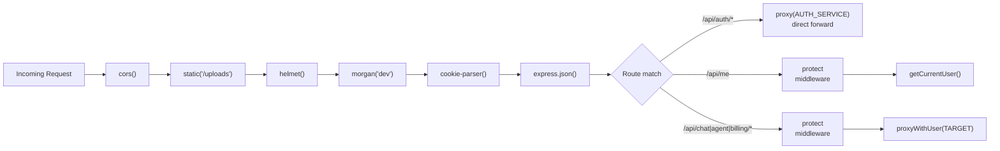

# API Gateway

The gateway is the single public-facing entry point for all browser traffic. It validates sessions, enriches requests with user identity headers, and reverse-proxies them to the appropriate downstream microservice.

**Location:** `backend/gateway/`  
**Entry point:** `backend/gateway/index.js`  
**Port:** `5000`

---

## Responsibility

- Terminate CORS and apply HTTP security headers
- Validate session cookies against Redis before forwarding protected requests
- Inject `x-user-id`, `x-user-email`, and `x-user-avatar` headers so downstream services know who the caller is without touching Redis themselves
- Serve the `/api/me` endpoint directly (does not proxy to any service)
- Forward all other requests to the correct service

The gateway has **no business logic** — it is purely an infrastructure layer.

---

## Route Table

| Path prefix | Middleware | Forwarded to |
|-------------|-----------|--------------|
| `POST /api/auth/login` | (none) | Auth Service (`AUTH_SERVICE` env) |
| `GET /api/auth/logout` | (none) | Auth Service |
| `GET /api/me` | `protect` | Handled **inline** by `getCurrentUser` controller |
| `* /api/chat/*` | `protect` → `proxyWithUser` | Chat Service (`CHAT_SERVICE` env) |
| `* /api/agent/*` | `protect` → `proxyWithUser` | Agent Service (`AGENT_SERVICE` env) |
| `* /api/billing/*` | `protect` → `proxyWithUser` | Billing Service (`BILLING_SERVICE` env) |

**Source:** `backend/gateway/index.js`

---

## Middleware Stack (in order)



1. **`cors`** — configured for `origin: "http://localhost:5173"` with `credentials: true`. This allows the browser to send cookies cross-origin.
2. **`express.static("uploads")`** — serves any local `uploads/` directory at `/uploads` (legacy; files are now stored in S3).
3. **`helmet()`** — sets standard HTTP security headers (X-Frame-Options, CSP, etc.).
4. **`morgan("dev")`** — HTTP request logging.
5. **`cookie-parser()`** — parses the `session` cookie into `req.cookies.session`.
6. **`express.json()`** — parses JSON request bodies.

---

## Session Validation — `protect` middleware

**File:** `backend/gateway/middlewares/auth.middleware.js`

```javascript
export const protect = async (req, res, next) => {
  const sessionId = req?.cookies?.session;
  if (!sessionId) return res.status(401).json({ message: "Unauthorized" });

  const session = await redis.get(`session:${sessionId}`);
  if (!session) return res.status(401).json({ message: "Session Expired" });

  req.user = JSON.parse(session);
  next();
};
```

**Step-by-step:**
1. Reads `req.cookies.session` — the opaque UUID set by the auth service on login.
2. If absent → `401 Unauthorized`.
3. Queries Redis for `session:{sessionId}`.
4. If key is missing or expired (7-day TTL) → `401 Session Expired`.
5. Parses the JSON blob into `req.user` — shape: `{ userId, email, avatar, name, plan, credits, totalCredits }`.
6. Calls `next()`.

The Redis client is the shared instance from `backend/shared/redis/redis.js`, which connects to `process.env.REDIS_URL`.

---

## User Header Injection — `proxyWithUser`

**File:** `backend/gateway/utils/proxyWithHeaders.js`

```javascript
export const proxyWithUser = (serviceUrl) => {
  return proxy(serviceUrl, {
    proxyReqOptDecorator: (proxyReqOpts, srcReq) => {
      if (srcReq.user) {
        proxyReqOpts.headers["x-user-id"]     = srcReq.user.userId;
        proxyReqOpts.headers["x-user-email"]  = srcReq.user.email;
        proxyReqOpts.headers["x-user-avatar"] = srcReq.user.avatar;
      }
      return proxyReqOpts;
    }
  });
};
```

After `protect` runs and populates `req.user`, `proxyWithUser` intercepts the outgoing proxy request and appends three custom headers. Downstream services (`chat`, `agent`, `billing`) read user identity **only** from these headers:

```javascript
const userId = req.headers["x-user-id"];
```

This pattern means downstream services are stateless with respect to authentication — they trust the gateway completely.

---

## `GET /api/me` — Current User Endpoint

**File:** `backend/gateway/controllers/user.controller.js`

This is the only route the gateway handles directly (not proxied). After `protect` validates the session, `getCurrentUser()` simply returns `req.user` (the session JSON from Redis) to the browser.

The frontend calls this on every page load (`useCurrentUser` hook in `frontend/src/hooks/useCurrentUser.jsx`) to hydrate the Redux user slice.

```
GET /api/me
→ protect middleware reads Redis
→ getCurrentUser() returns req.user as JSON
← { success: true, user: { userId, email, avatar, name, plan, credits, totalCredits } }
```

---

## Environment Variables

Located at `backend/gateway/.env`:

| Variable | Used for |
|----------|---------|
| `PORT` | Gateway listen port (defaults to `5000`) |
| `REDIS_URL` | Shared Redis connection string |
| `AUTH_SERVICE` | URL of the auth service (e.g., `http://localhost:5001`) |
| `CHAT_SERVICE` | URL of the chat service |
| `AGENT_SERVICE` | URL of the agent service |
| `BILLING_SERVICE` | URL of the billing service |

---

## End-to-End Request Trace: Protected Route

```
Browser → GET /api/chat/get-conversations  (Cookie: session=abc-123)
  ↓
Gateway: cookie-parser parses cookie
  ↓
protect(): redis.get("session:abc-123") → { userId:"...", email:"...", ... }
  ↓
proxyWithUser(CHAT_SERVICE): adds x-user-id, x-user-email, x-user-avatar headers
  ↓
HTTP proxy → GET http://localhost:5002/get-conversations
  ↓
Chat Service: reads x-user-id from req.headers["x-user-id"]
  ↓
Conversation.find({ userId }) → [...conversations]
  ↓
Chat Service → Gateway → Browser: [...conversations]
```

---

## Gotchas / Things to Know

- **Auth routes are completely unprotected at the gateway level.** `proxy(process.env.AUTH_SERVICE)` (line 27 of `index.js`) forwards all `/api/auth/*` requests including the `/internal/*` sub-paths. However, `/internal/*` is never reachable from a browser because there is no client-side code that calls those paths. In production, these should be blocked at the network level or via an explicit deny rule.
- **The proxy library is `express-http-proxy`, not `http-proxy-middleware`.** The `proxyReqOptDecorator` callback signature is specific to this library. Switching proxy libraries would require rewriting `proxyWithHeaders.js`.
- **Multipart/form-data requests (file uploads)** pass through the proxy unmodified. `multer` runs on the agent service, not the gateway. The gateway does not parse file uploads itself.
- **No request body parsing needed for proxied routes.** `express.json()` is registered but the proxy forwards raw body bytes to downstream services. The JSON middleware only affects the gateway's own routes (`/api/me`).
- **No rate limiting at the gateway.** Rate limiting is implemented per-agent inside the agent service using Redis (`backend/services/agent/config/agentRateLimit.js`). There is no global rate limiter at the gateway.
- **CORS `origin` is hardcoded to `localhost:5173`.** This must be changed for any staging or production deployment.
- **The `uploads/` static directory** is a leftover. Since S3 is used for file storage, this directory is no longer relevant.
