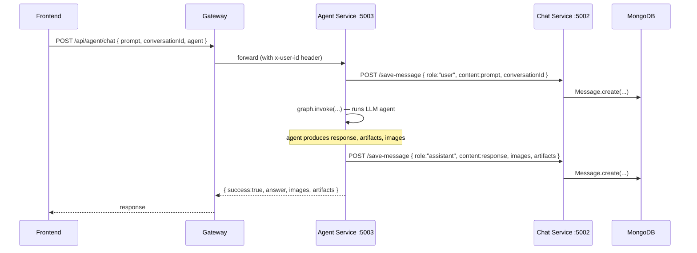

# Chat Service — Conversation & Message Persistence

The chat service is a thin persistence layer. It has no AI logic — its sole job is to store conversations and messages in MongoDB and retrieve them on demand. Both the browser (via the gateway) and the agent service (directly) write to it.

**Location:** `backend/services/chat/`  
**Entry point:** `backend/services/chat/index.js`  
**Port:** `5002`

---

## Responsibility

- Create and list `Conversation` documents per user
- Save `Message` documents (user and assistant turns) with optional images and structured artifacts
- Load message history for a conversation (used by the frontend to display history, and by the agent service to build conversation context)
- Update a conversation's title (set after the first message is sent)

---

## Data Models

### Conversation

**File:** `backend/services/chat/models/conversation.model.js`

```
Conversation {
  userId:    String (required)   — value injected by gateway (x-user-id header)
  title:     String (default: "New Chat")
  createdAt, updatedAt           — Mongoose timestamps
}
```

`userId` is a plain string (not an ObjectId) because it comes from the gateway header, which supplies the MongoDB `_id` of the user as a string.

### Message

**File:** `backend/services/chat/models/message.model.js`

```
Message {
  conversationId: ObjectId (ref: "Conversation")
  role:           String (enum: ["user", "assistant"])
  content:        String
  images:         [String]       — array of S3 presigned URL strings
  artifacts:      [ArtifactSchema]
  createdAt, updatedAt
}

ArtifactSchema {
  id:        Number
  type:      String (e.g. "project")
  title:     String
  files:     [FileSchema]
  createdAt: String
}

FileSchema {
  name:    String   — filename (e.g. "index.html")
  content: String   — raw file content
}
```

The `artifacts` array stores code generation output (multi-file projects from the coding agent) directly in MongoDB as embedded documents. For PDFs, PPTs, and images, the agent stores only a markdown download link in `content`; there is no `artifacts` entry.

---

## API Routes

**File:** `backend/services/chat/routes/chat.routes.js`  
Mounted at `/` in `index.js`, so these are accessible at their full path from the gateway under `/api/chat/`.

| Method | Path | Controller | Called by |
|--------|------|-----------|-----------|
| `POST` | `/create-conversation` | `createConversation()` | Frontend (via gateway) |
| `GET` | `/get-conversations` | `getConversations()` | Frontend (via gateway) |
| `POST` | `/update-conversation` | `updateConversation()` | Frontend (via gateway) |
| `POST` | `/save-message` | `saveMessage()` | Agent service (direct, no gateway) |
| `GET` | `/get-messages/:id` | `getMessages()` | Frontend (via gateway) + Agent service (direct) |

---

## Step-by-Step: Conversation Creation

Triggered when the user sends their first message in an empty chat pane.

1. **`ChatInput.jsx` — `handleSend()`** detects `selectedConversation === null`.
2. Calls `createConversation()` from `frontend/src/features/conversation.api.js`.
3. **`POST /api/chat/create-conversation`** → gateway → `protect` → `proxyWithUser` → chat service.
4. **`createConversation()` controller** (`backend/services/chat/controllers/chat.controller.js` line 4):
   - Reads `userId` from `req.headers["x-user-id"]`.
   - Creates `Conversation({ userId })` — title defaults to `"New Chat"`.
   - Returns the saved document.
5. Frontend: `dispatch(addConversation(newConversation))` + `dispatch(setSelectedConversation(newConversation))`.
6. **Title update**: if `conversation.title === "New Chat"`, the frontend immediately calls `updateConversations(conversationId, prompt.slice(0, 40))` to set the first 40 characters of the prompt as the title. This is handled by the `updateConversation()` controller (`chat.controller.js` line 127).

---

## Step-by-Step: Message Persistence

Messages are saved in **two places simultaneously** by the agent service after each exchange. The agent service calls the chat service **directly** (bypassing the gateway) using `process.env.CHAT_SERVICE`.



**Controller:** `saveMessage()` (`chat.controller.js` line 58)  
Receives `{ conversationId, role, content, images, artifacts }` and creates a `Message` document. No validation of `role` beyond the Mongoose enum.

---

## Step-by-Step: Loading Message History

### From the frontend (sidebar click)

1. **`Sidebar.jsx` — `handleSelectConversation(conversation)`** calls `getMessages(conversation._id)` from `frontend/src/features/message.api.js`.
2. **`GET /api/chat/get-messages/:id`** → gateway → `protect` → `proxyWithUser` → chat service.
3. **`getMessages()` controller** (`chat.controller.js` line 98):
   - `Message.find({ conversationId: req.params.id }).sort({ createdAt: 1 })`.
4. Frontend dispatches `setMessages(messages)` and `setArtifacts(messages.artifacts)`.

### From the agent service (conversation context)

The agent service calls the same endpoint directly to fetch history for the LLM's context window:

**File:** `backend/services/agent/utils/getConv.js`
```javascript
await axios.get(`${process.env.CHAT_SERVICE}/get-messages/${conversationId}`);
```

This result is cached in Redis under `conversation:{conversationId}` for 24 hours by `memory.js`.

---

## Step-by-Step: Fetching All Conversations (Sidebar)

1. On mount of `Sidebar.jsx` (effect depends on `userData?._id`), calls `getConversations()`.
2. **`GET /api/chat/get-conversations`** → gateway → chat service.
3. **`getConversations()` controller** (`chat.controller.js` line 28):
   - `Conversation.find({ userId }).sort({ updatedAt: -1 })`.
4. Returns list sorted newest-first.
5. Frontend dispatches `setConversations(data)`.

---

## Internal Service Communication

The chat service receives calls from **two different callers**:

| Caller | How it calls | Auth mechanism |
|--------|-------------|---------------|
| Frontend (browser) | Via gateway, with session cookie | `protect` middleware + `proxyWithUser` |
| Agent Service | Direct HTTP via `axios` using `CHAT_SERVICE` env var | **No authentication — completely open** |

The chat service has no middleware to validate that calls to `/save-message` or `/get-messages/:id` are legitimate. Any process that can reach port 5002 can read or write messages for any conversation ID.

---

## Database

**Config:** `backend/services/chat/config/db.js`  
Connects to `process.env.MONGODB_URL` via Mongoose. Same pattern as auth and billing services.

---

## Gotchas / Things to Know

- **`saveMessage` has no authorization check** — any caller can save messages to any `conversationId`. In practice only the agent service calls this, but it is architecturally unsafe.
- **`artifacts` on messages returned by `getMessages` is an embedded array** — `Sidebar.jsx` dispatches `setArtifacts(messages.artifacts)` when selecting a conversation, but `messages` is an array of message objects, not a single message. `messages.artifacts` is always `undefined`. This is a bug: artifacts are not restored when switching back to a past conversation.
- **No conversation ownership check on `getMessages/:id`** — the `getMessages` controller fetches all messages for the given `conversationId` without checking that the requesting user owns that conversation. Any authenticated user could read another user's messages by guessing a `conversationId`.
- **`updateConversation` has no ownership check** — any user can rename any conversation by ID.
- **No soft delete or archive** — there is no way to delete a conversation. The sidebar shows all conversations ever created.
- **`userId` is stored as a `String` in `Conversation`**, not as a typed `ObjectId`. This is intentional (it comes from a header string) but means you cannot use Mongoose's `populate()` to join to the `User` collection without type-casting.
- **The chat service has no rate limiting** — it relies on the agent service's per-agent rate limiter and the gateway's session validation. Direct calls to the chat service port are completely unrestricted.
