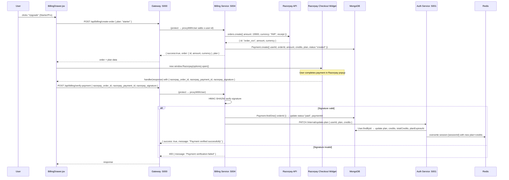

# Billing Service — Payments & Plan Management

The billing service integrates with Razorpay to create payment orders and verify payment signatures. After a successful payment it calls the auth service to upgrade the user's plan and credit balance.

**Location:** `backend/services/billing/`  
**Entry point:** `backend/services/billing/index.js`  
**Port:** `5004`

---

## Responsibility

- Accept a plan selection from the frontend and create a Razorpay order
- Persist a `Payment` record in MongoDB with status `"created"`
- Receive the Razorpay payment callback, verify the HMAC-SHA256 signature
- On successful verification: update the `Payment` record to `"paid"` and trigger `updatePlan` on the auth service
- Expose plan definitions and credit costs as configuration constants

---

## Plans

**File:** `backend/services/billing/config/plans.js`

| Plan | ID | Amount (INR) | Credits | Validity |
|------|----|-------------|---------|---------|
| Free | `free` | ₹0 | 100 | 30 days |
| Starter | `starter` | ₹199 | 500 | 30 days |
| Pro | `pro` | ₹499 | 1000 | 30 days |

The `free` plan is registered but is never purchased via Razorpay (it's the default on signup). The Razorpay SDK would reject a ₹0 order.

---

## API Routes

**File:** `backend/services/billing/routes/billing.routes.js`  
Accessible from the frontend via the gateway at `/api/billing/*`.

| Method | Path | Controller | Caller |
|--------|------|-----------|--------|
| `POST` | `/create-order` | `createOrder()` | Frontend (BillingDrawer.jsx) |
| `POST` | `/verify-payment` | `verifyPayment()` | Frontend (Razorpay callback) |

---

## Step-by-Step: Payment Flow



---

## Step 1 — Create Order

**Controller:** `createOrder()` in `backend/services/billing/controllers/billing.controller.js` (line 7)

1. Reads `plan` from `req.body` and `userId` from `req.headers["x-user-id"]` (injected by gateway).
2. Looks up `PLANS[plan]` from `backend/services/billing/config/plans.js`. Returns `400` if plan not found.
3. Calls `razorpay.orders.create({ amount: selectedPlan.amount * 100, currency: "INR", receipt: "receipt_${Date.now()}" })`. Razorpay amounts are in paise (1 INR = 100 paise).
4. Creates a `Payment` document in MongoDB with `status: "created"` and links it to the Razorpay `order.id`.
5. Returns the `order` object and `plan` details to the frontend.

**Razorpay client:** `backend/services/billing/config/razorpay.js`  
Initialised with `RAZORPAY_KEY_ID` and `RAZORPAY_KEY_SECRET` from `.env`.

---

## Step 2 — Razorpay Checkout Widget (Frontend)

**File:** `frontend/src/components/BillingDrawer.jsx` — `handleUpgrade()` function

1. Calls `createOrder(plan)` (which calls `POST /api/billing/create-order`).
2. Constructs a Razorpay options object:
   ```javascript
   {
     key: import.meta.env.VITE_RAZORPAY_KEY,
     amount: data.order.amount,
     currency: data.order.currency,
     name: "CortexAI",
     description: `${data.plan.name} Plan`,
     order_id: data.order.id,
     handler: async (response) => { /* calls verify-payment */ },
     theme: { color: "#4F46E5" }
   }
   ```
3. Instantiates `new window.Razorpay(options)` and calls `.open()`. The Razorpay JS SDK must be loaded from their CDN (not bundled — this is loaded via a `<script>` tag that is not visible in the codebase, meaning it must be in `frontend/index.html` or assumed to be pre-loaded).
4. On successful payment, Razorpay calls the `handler` function with a response containing `razorpay_order_id`, `razorpay_payment_id`, and `razorpay_signature`.

---

## Step 3 — Verify Payment & Upgrade Plan

**Controller:** `verifyPayment()` in `billing.controller.js` (line 88)

1. Receives `{ razorpay_order_id, razorpay_payment_id, razorpay_signature }`.
2. **Signature verification** (lines 102–136):
   ```
   expected = HMAC-SHA256(secret, "${razorpay_order_id}|${razorpay_payment_id}")
   if (expected !== razorpay_signature) → 400
   ```
   This prevents a malicious actor from faking a successful payment callback.
3. Finds the `Payment` document by `orderId = razorpay_order_id`. Returns `404` if not found.
4. Updates `payment.status = "paid"` and `payment.paymentId = razorpay_payment_id`. Saves.
5. Calls `AUTH_SERVICE/internal/update-plan` via `axios.patch`:
   ```javascript
   await axios.patch(`${process.env.AUTH_SERVICE}/internal/update-plan`, {
     userId: payment.userId,
     plan: payment.plan,
     credits: payment.credits
   });
   ```
6. Returns `{ success: true }`.

---

## Payment Model

**File:** `backend/services/billing/models/payment.model.js`

```
Payment {
  userId:    String (required)   — x-user-id at time of order
  orderId:   String (required)   — Razorpay order ID
  paymentId: String              — Razorpay payment ID (set after verification)
  amount:    Number              — in INR (not paise)
  currency:  String (default: "INR")
  credits:   Number              — credits to add to the user
  plan:      String              — plan ID ("starter" | "pro")
  status:    String (enum: ["created", "paid", "failed"], default: "created")
  createdAt, updatedAt
}
```

There is no `"failed"` status write path in the current code — the status is only set to `"paid"` on success. Failed payments leave the record as `"created"` indefinitely.

---

## Dependencies on Other Services

| Dependency | Direction | Protocol | Purpose |
|-----------|-----------|----------|---------|
| Auth Service | Billing → Auth | HTTP `axios.patch` | Trigger `updatePlan` after payment |
| Razorpay | Billing → Razorpay | `razorpay` SDK | Create orders, verify signatures |
| MongoDB | Billing → MongoDB | Mongoose | Store `Payment` records |

The billing service has **no dependency on Redis** — it doesn't need to read sessions. User identity comes from the `x-user-id` header.

---

## Environment Variables

Located at `backend/services/billing/.env`:

| Variable | Used for |
|----------|---------|
| `PORT` | Service listen port |
| `MONGODB_URL` | MongoDB connection string |
| `RAZORPAY_KEY_ID` | Razorpay API key |
| `RAZORPAY_KEY_SECRET` | Razorpay secret (used for HMAC verification) |
| `AUTH_SERVICE` | URL of auth service (for `update-plan` internal call) |

---

## Gotchas / Things to Know

- **Razorpay JS SDK is not included in the frontend bundle.** The `BillingDrawer.jsx` uses `new window.Razorpay(options)`, which means the SDK script must be loaded globally. There is no `<script src="...razorpay...">` tag visible in `frontend/index.html` (not read in this audit). If it's missing, payments will silently fail with a `window.Razorpay is not a function` error.
- **`userId` stored in `Payment` is a string from the header at order time.** If the same user creates an order before logging out and a different user somehow calls `verify-payment` with that order ID, the credits would go to the wrong user. The verify endpoint does not re-check the `x-user-id` header against `payment.userId`.
- **`status: "failed"` is never written.** Abandoned or truly failed payments are stuck as `"created"`. There is no webhook integration with Razorpay to handle async payment failure events.
- **No idempotency guard on `verify-payment`.** Calling `verify-payment` twice for the same `orderId` would credit the user twice (the HMAC check would still pass; `payment.status` would be set to `"paid"` again). The auth service's `updatePlan` would also run twice, adding credits twice.
- **After payment, the frontend does not refresh user data.** The `handler` in `BillingDrawer.jsx` logs the response but does not dispatch `setUserData` or call `/api/me`. The credits/plan display in the sidebar will not update until the next page reload.
- **`VITE_RAZORPAY_KEY` is the public key** (used only for the Razorpay widget). The secret key `RAZORPAY_KEY_SECRET` stays on the backend and is never sent to the browser.
