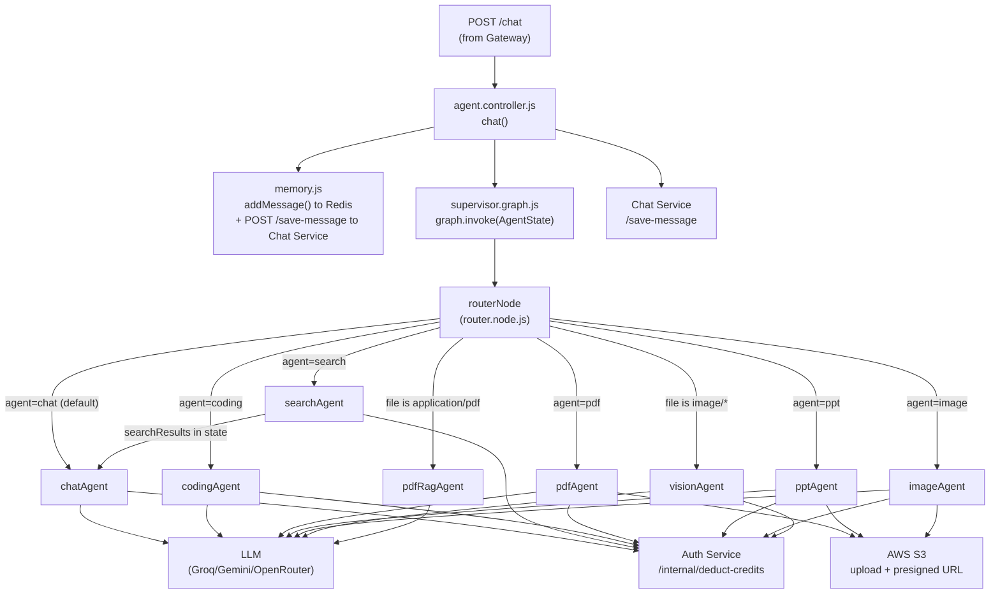

# Agent Service — LangGraph Multi-Agent System

The agent service is the AI core of CortexAI. It uses a LangGraph `StateGraph` to route every user prompt to one of eight specialized sub-agents, each of which handles a distinct capability. The graph runs synchronously and returns a structured result that is saved to the chat service and returned to the browser.

**Location:** `backend/services/agent/`  
**Entry point:** `backend/services/agent/index.js`  
**Port:** `5003`

---

## Responsibility

- Accept a user prompt (and optionally a file attachment) from the gateway
- Enforce per-agent rate limits using Redis
- Deduct credits from the user's account via the auth service
- Route the prompt through a LangGraph supervisor graph to the correct sub-agent
- Save both the user message and the assistant response to the chat service
- Return `{ answer, images, artifacts }` to the gateway

---

## High-Level Architecture



---

## LangGraph State

**File:** `backend/services/agent/graph/state.js`

```javascript
AgentState = {
  prompt:        string    // user's message
  conversationId:string    // MongoDB conversation _id
  userId:        string    // from x-user-id header
  agent:         string    // routing target or "auto"
  response:      string    // final text response
  images:        string[]  // presigned URLs for search images
  model:         string    // (unused in routing, per-agent models are hardcoded)
  file:          object    // multer file object (path, mimetype, etc.)
  artifacts:     array     // code generation output
  searchResults: any       // Tavily results (passed to chatAgent)
  codeContext:   any       // (declared but unused)
  pdfContext:    any       // (declared but unused)
}
```

State flows forward through the graph; each node receives the full state and returns a partial update which is merged in.

---

## Step-by-Step: Request Lifecycle

### 1. HTTP ingress

**Route:** `POST /chat`  
**File:** `backend/services/agent/routes/agent.route.js`  
```javascript
router.post("/chat", multer.single("file"), chat);
```

`multer` is configured in `backend/services/agent/config/multer.js` with disk storage writing to the `temp/` directory. Accepted file types: PDF and images.

### 2. Controller (`chat()`)

**File:** `backend/services/agent/controllers/agent.controller.js`

1. Destructures `{ prompt, conversationId, agent }` from `req.body`.
2. Calls `addMessage(conversationId, "user", prompt)` — writes to Redis conversation cache.
3. Calls `axios.post(CHAT_SERVICE/save-message, { conversationId, role:"user", content:prompt })` — persists to MongoDB.
4. Calls `graph.invoke({ prompt, conversationId, userId, agent, file: req.file })` — runs the LangGraph graph. **This is a blocking await.**
5. After the graph returns `result`:
   - Calls `addMessage(conversationId, "assistant", result.response)` — updates Redis cache.
   - Calls `axios.post(CHAT_SERVICE/save-message, { conversationId, role:"assistant", content:result.response, images:result.images, artifacts:result.artifacts })`.
6. Returns `{ success:true, answer:result.response, images:result.images, artifacts:result.artifacts || [] }`.
7. Errors are passed to `next(error)` — the global error handler returns `err.status` and `err.data` if present (used by rate limiter and credit errors).

### 3. LangGraph Router Node

**File:** `backend/services/agent/graph/router.node.js` — `routerNode()`

The router decides which agent to dispatch to. Evaluation order:

1. **Explicit agent override:** If `state.agent` is set and is not `"auto"`, return as-is. The frontend sends the user-selected agent (e.g., `"coding"`) from the agent picker buttons in `ChatInput.jsx`.
2. **File type detection (image):** If `state.file` exists and `state.file.mimetype.startsWith("image/")` → set `agent: "vision"`.
3. **File type detection (PDF):** If `state.file.mimetype === "application/pdf"` → set `agent: "pdf_rag"`.
4. **LLM routing (auto mode):** If `state.agent === "auto"`, calls `getModel("router")` (which returns the Groq Llama-3.3 model) with a prompt that lists available agents and asks it to classify the user's query. Returns a single word: `chat`, `search`, `coding`, `pdf`, or `ppt`.

### 4. Conditional edge routing

**File:** `backend/services/agent/graph/supervisor.graph.js` (lines 90–141)

```javascript
workflow.addConditionalEdges("router", (state) => {
  switch(state.agent) {
    case "search":  return "search";
    case "coding":  return "coding";
    case "pdf":     return "pdf";
    case "ppt":     return "ppt";
    case "image":   return "image";
    case "vision":  return "vision";
    case "pdf_rag": return "pdf_rag";
    default:        return "chat";
  }
});
```

The `search` agent does **not** go directly to `__end__` — it routes to `chat`:
```javascript
workflow.addEdge("search", "chat");
```
So a web search query traverses: `router → search → chat → __end__`.

### 5. Sub-agent execution

Each sub-agent:
1. Calls `checkAgentLimit(userId, agentName)` — Redis-based rate limiter.
2. Calls `deductCredits(userId, agentName)` — HTTP call to auth service.
3. Executes its AI logic.
4. Returns updated state.

---

## Sub-Agents in Detail

### `chatAgent` — General Conversation

**File:** `backend/services/agent/agents/chat.agent.js`  
**Model:** Groq `llama-3.3-70b-versatile` (via `getModel("chat")`)

1. Calls `checkAgentLimit` + `deductCredits` (1 credit).
2. Calls `getMemory(conversationId)` — fetches conversation history from Redis (or falls back to chat service HTTP call, then caches in Redis for 24 hours).
3. If `state.searchResults` is set (coming from `searchAgent`), prepends a `searchContext` block to the system prompt instructing the LLM to answer using only the search results.
4. Builds a messages array: `[SystemMessage, ...history, HumanMessage(prompt)]`.
5. Invokes the LLM. Returns `{ response: response.content, images: state.searchResults?.images || [] }`.

System prompt persona: `"You are CortexAI, an intelligent AI assistant."` with formatting rules (Markdown headings, bullet points, fenced code blocks).

### `searchAgent` — Web Search

**File:** `backend/services/agent/agents/search.agent.js`  
**Tool:** Tavily Search (`@langchain/tavily`) — configured in `utils/tavily.js` with `maxResults: 5, includeImages: true`

1. Calls `checkAgentLimit` + `deductCredits` (5 credits).
2. Calls `searchTool.invoke({ query: state.prompt })`.
3. Returns `{ searchResults: results }` — the `chat` agent then uses these results via its `searchContext`.
4. **Does not produce a response directly.** Control passes to `chatAgent` via the `search → chat` edge.

### `codingAgent` — Code Generation & Review

**File:** `backend/services/agent/agents/coding.agent.js`  
**Model:** DeepSeek Chat via OpenRouter (`@langchain/openrouter`, `maxTokens: 2500`)

1. Calls `checkAgentLimit` + `deductCredits` (10 credits).
2. Sends a large structured prompt to the LLM that includes intent classification (CODE_GENERATION vs CODE_REVIEW), design rules, and an output format.
3. **For code generation:** The LLM output uses a `FILE: filename\n...content...` format. The agent parses this with a regex:
   ```javascript
   /FILE:\s*([^\n]+)\n([\s\S]*?)(?=\nFILE:\s*[^\n]+\n|$)/g
   ```
4. Each parsed file is cleaned with `cleanCode()` (strips fenced code block markers).
5. Returns:
   - If `FILE:` markers found: `{ response: "Code generated successfully.", artifacts: [{ id, type:"project", title, files:[{name,content}], createdAt }] }`
   - If no `FILE:` markers: `{ response: content, artifacts: [] }` (review/explanation output)

### `pdfAgent` — PDF Document Generation

**File:** `backend/services/agent/agents/pdf.agent.js`  
**Model:** Groq Llama-3.3 (via `getModel("pdf")`)  
**Dependencies:** `pdfkit`, `uploadToS3`, `getDownloadUrl`

1. Calls `checkAgentLimit` + `deductCredits` (10 credits).
2. Prompts the LLM to generate plain text content (no markdown, no code blocks).
3. Uses `pdfkit` to build an A4 PDF with: title (26pt), generated date, content body (12pt), footer.
4. Collects PDF buffer via `doc.on("data", chunk => chunks.push(chunk))`.
5. Calls `uploadToS3(pdfBuffer, "pdf-{timestamp}.pdf", "application/pdf")`.
6. Calls `getDownloadUrl(fileName, 24*60*60)` — generates a presigned S3 URL valid for **24 hours** (but the response says "expires in 10 minutes" — mismatch in the UI string).
7. Returns a markdown response with a download link.

### `pptAgent` — PowerPoint Generation

**File:** `backend/services/agent/agents/ppt.agent.js`  
**Model:** Groq Llama-3.3 (via `getModel("ppt")`)  
**Dependencies:** `pptxgenjs`, `uploadToS3`, `getDownloadUrl`

1. Calls `checkAgentLimit` + `deductCredits` (10 credits).
2. Prompts LLM with a structured format: `TITLE:`, `SUBTITLE:`, then `SLIDE:` blocks with `Type:` and `- bullet` lines.
3. `parseResponse(content)` splits on `SLIDE:` and extracts title, type (`bullets`|`stats`|`conclusion`), and items.
4. Builds a `.pptx` using `pptxgenjs` with three slide templates:
   - `addCoverSlide()` — dark background, large title, decorative circles
   - `addBulletSlide()` — card-per-bullet layout with alternating colors
   - `addStatSlide()` — dark background, large metric values in cards
   - `addConclusionSlide()` — blue background, key takeaways
5. Exports as `nodebuffer`, uploads to S3, returns presigned URL.

### `imageAgent` — AI Image Generation

**File:** `backend/services/agent/agents/imageGen.agent.js`  
**Model:** Groq Llama-3.3 (for prompt enhancement)  
**Image API:** Pollinations.ai REST API

1. Calls `checkAgentLimit` + `deductCredits` (10 credits).
2. Sends the user's prompt to the LLM with a "prompt engineer" system message, asking it to enhance the prompt with cinematographic, photorealistic details.
3. Constructs a Pollinations URL: `https://image.pollinations.ai/prompt/{encodedPrompt}`.
4. Downloads the image via `axios.get(imageUrl, { responseType: "arraybuffer" })`.
5. Uploads to S3 as `"image-{timestamp}.png"`.
6. Returns a markdown response with an inline image and download link. Presigned URL valid for 24 hours.

### `visionAgent` — Image Analysis

**File:** `backend/services/agent/agents/vision.agent.js`  
**Model:** Gemini 2.5 Flash (via `getModel("vision")`, the only multimodal model in the system)

1. Triggered when the user uploads an image file.
2. Calls `checkAgentLimit("image")` + `deductCredits("image")` — uses the `image` slot (10 credits), same as `imageAgent`.
3. Reads the uploaded file from disk: `fs.readFile(state.file.path)`.
4. Converts to base64.
5. Sends a multimodal message to Gemini:
   ```javascript
   new HumanMessage({
     content: [
       { type: "text", text: state.prompt || "Describe this image." },
       { type: "image_url", image_url: { url: `data:${mimetype};base64,${base64Image}` } }
     ]
   })
   ```
6. In `finally` block: deletes the temp file with `fs.unlink(state.file.path)`.

### `pdfRagAgent` — PDF Question Answering (RAG)

**File:** `backend/services/agent/agents/pdfRag.agent.js`  
**Model:** Groq Llama-3.3 (via `getModel("pdf-rag")`)  
**Dependencies:** `pdf-parse`, `@langchain/textsplitters`, `@langchain/qdrant`, `GoogleGenerativeAIEmbeddings`

1. Triggered when the user uploads a PDF file.
2. Reads the file from disk: `fs.readFileSync(state.file.path)`.
3. Parses PDF text using `new PDFParse({ data: buffer })`.
4. Splits text into chunks: `RecursiveCharacterTextSplitter({ chunkSize: 1000, chunkOverlap: 200 })`.
5. Creates a Qdrant collection named `pdf-{timestamp}`, uploads all chunks with `gemini-embedding-001` embeddings.
6. Performs `vectorStore.similaritySearch(state.prompt, 5)` — retrieves top 5 relevant chunks.
7. Passes the retrieved context to Groq LLM with the user's question.
8. In `finally` block: attempts to delete the temp file and the Qdrant collection (see Gotchas).

---

## Rate Limiting

**File:** `backend/services/agent/config/agentRateLimit.js`

Uses Redis `INCR` + `EXPIRE` to implement a per-user, per-agent sliding window (60-second window):

| Agent | Requests/minute |
|-------|----------------|
| `chat` | 20 |
| `search` | 5 |
| `coding` | 5 |
| `pdf` | 5 |
| `ppt` | 5 |
| `image` | 3 |

Redis key format: `rate:{agent}:{userId}`

On first request: `INCR` the key, then `EXPIRE` it for 60 seconds. On subsequent requests within the window, only `INCR`. When count exceeds the limit, throws an error with `status: 429` and a human-readable retry time.

---

## Conversation Memory

**File:** `backend/services/agent/utils/memory.js`

- `getMemory(conversationId)` — checks `conversation:{conversationId}` in Redis. If not cached, fetches from chat service (`GET /get-messages/:id`) and caches for 24 hours.
- `addMessage(conversationId, role, content)` — appends to the Redis cache. **Window capped at 20 messages** (oldest is shifted out when exceeded). Does not persist to MongoDB (that is done separately by the controller via the chat service).

---

## LLM Model Assignment

**File:** `backend/services/agent/utils/model.js`

| Agent(s) | Model | Provider |
|----------|-------|---------|
| `chat`, `search`, `image`, `pdf`, `ppt`, `router` | `llama-3.3-70b-versatile` | Groq |
| `coding` | `deepseek/deepseek-chat` | OpenRouter |
| `vision` | `gemini-2.5-flash` | Google Gemini |
| (embeddings) | `gemini-embedding-001` | Google Gemini |

---

## File Upload

**Config:** `backend/services/agent/config/multer.js`  
**Storage:** Disk, `temp/` directory  
**Accepted:** `.pdf`, `image/*`

Files are uploaded by the browser as `multipart/form-data`. The gateway proxies the multipart body without parsing it. Multer runs only on the agent service.

After use, agents are responsible for deleting temp files in their `finally` blocks (`vision.agent.js` and `pdfRag.agent.js`).

---

## AWS S3 Integration

**Files:** `utils/s3.js`, `utils/uploadToS3.js`, `utils/getDownloadUrl.js`

- `s3.js`: creates an `S3Client` with `AWS_REGION`, `AWS_ACCESS_KEY_ID`, `AWS_SECRET_ACCESS_KEY`.
- `uploadToS3(buffer, fileName, contentType)`: `PutObjectCommand` to `AWS_BUCKET_NAME`.
- `getDownloadUrl(fileName, expiresIn)`: `GetObjectCommand` + `getSignedUrl` from `@aws-sdk/s3-request-presigner`. Default `expiresIn` is 600 seconds; pdf/ppt/image agents pass `24*60*60` (24 hours).

---

## Gotchas / Things to Know

- **`pdfRag.agent.js` has a scoping bug.** `collectionName` is declared inside a `try` block, but `QdrantVectorStore.deleteCollection(collectionName)` in the `finally` block references it from outside its scope. This will throw a `ReferenceError` every time pdfRag runs, meaning the Qdrant collection is **never cleaned up**. Collections accumulate indefinitely.
- **`pdfRag.agent.js` has no `deductCredits` or `checkAgentLimit` call.** Unlike every other agent, `pdfRagAgent` skips both the rate limit and credit deduction. Users can upload unlimited PDFs for free.
- **The `vision` agent uses the `"image"` cost slot** (`checkAgentLimit("image")`, `deductCredits("image")`) rather than a dedicated `"vision"` slot. This means vision and image generation share the same rate limit bucket (3 requests/minute combined).
- **The PDF and image presigned URLs expire in 24 hours**, but the user-facing response message says `"⏳ Link expires in 10 minutes."` This is a stale string that was not updated when the expiry was extended.
- **Conversation memory window is 20 messages.** After 20 turns, the oldest messages are evicted from Redis. The full history remains in MongoDB but will not be in the LLM's context window until the Redis cache is rebuilt.
- **The `model` field in `AgentState` is declared but never used.** Model selection is always done inside the agent via `getModel(agentName)`. The state field is vestigial.
- **`codeContext` and `pdfContext` in `AgentState` are declared but never used** by any agent or node.
- **There is no streaming.** `graph.invoke()` waits for the entire LLM response before returning. Long generations (especially coding and PPT) will have noticeable latency with no progress indication.
- **File type validation is weak.** `multer` accepts `accept: ".pdf,image/*"` on the frontend, but the multer config on the server does not restrict MIME types. A user can upload arbitrary binary files.
