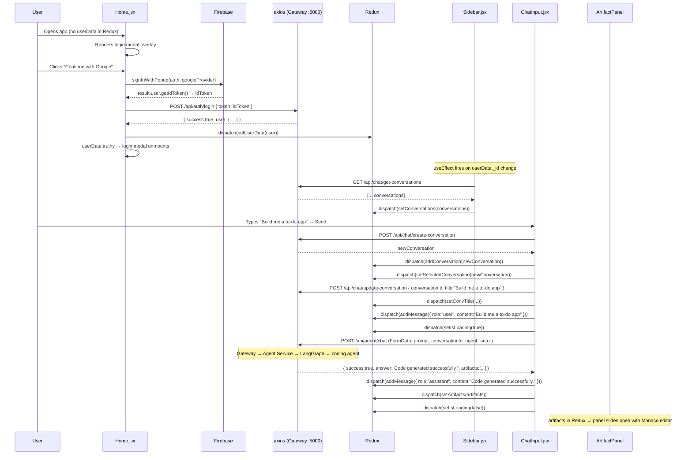

# Frontend — Architecture & Data Flow

The frontend is a single-page React application built with Vite. It is a chat interface with a sidebar for conversation history, a main chat area, and a collapsible code artifact panel. Authentication is done via Firebase (Google OAuth), state is managed with Redux Toolkit, and all API calls go to the backend gateway with session cookies.

**Location:** `frontend/`  
**Entry point:** `frontend/src/main.jsx`  
**Dev port:** `5173`  
**Build tool:** Vite

---

## Folder / Component Structure

```
frontend/
├── firebase.js                  — Firebase client SDK init (Google + GitHub providers)
├── index.html                   — Vite HTML template (Razorpay CDN script should be here)
├── vite.config.js               — Vite config
├── src/
│   ├── main.jsx                 — React root: wraps App in Redux <Provider>
│   ├── App.jsx                  — Router setup + useCurrentUser hook
│   ├── index.css                — Global base styles
│   │
│   ├── pages/
│   │   └── Home.jsx             — Single page; renders Sidebar + ChatArea + ArtifactPanel
│   │                              + login modal when unauthenticated
│   │
│   ├── components/
│   │   ├── Sidebar.jsx          — Conversation list, new chat, user info, billing trigger
│   │   ├── ChatArea.jsx         — Container: wraps MessageList + ChatInput + AiBanner
│   │   ├── ChatInput.jsx        — Prompt textarea, agent picker, file attach, mic, send
│   │   ├── MessageList.jsx      — Renders all messages in the active conversation
│   │   ├── MessageBubble.jsx    — Individual message: text, images, markdown rendering
│   │   ├── ArtifactPanel.jsx    — Code viewer (Monaco editor) + preview pane
│   │   ├── BillingDrawer.jsx    — Slide-in billing/upgrade panel
│   │   ├── AiBanner.jsx         — Error/rate-limit banner shown above ChatInput
│   │   ├── Navbar.jsx           — (minimal; likely unused top nav)
│   │   └── ModelSelector.jsx    — (stub/placeholder, not wired up)
│   │
│   ├── redux/
│   │   ├── store.js             — configureStore: user + conversation + message slices
│   │   ├── user.slice.js        — { userData } — set by login/me endpoint
│   │   ├── conversation.slice.js— { conversations[], selectedConversation }
│   │   └── message.slice.js     — { messages[], isLoading, artifacts[] }
│   │
│   ├── features/               — API call functions (no RTK Query, raw axios)
│   │   ├── agent.api.js        — sendPrompt(payload) → POST /api/agent/chat
│   │   ├── conversation.api.js — getConversations, createConversation, updateConversations
│   │   ├── message.api.js      — getMessages(conversationId) → GET /api/chat/get-messages/:id
│   │   └── billing.api.js      — createOrder(plan) → POST /api/billing/create-order
│   │
│   ├── hooks/
│   │   └── useCurrentUser.jsx  — On mount: GET /api/me → dispatch(setUserData)
│   │
│   └── utils/
│       ├── axios.js            — Axios instance (baseURL + withCredentials:true)
│       └── detectLanguage.js   — Maps file extension → Monaco language ID
```

---

## State Management (Redux Toolkit)

**File:** `frontend/src/redux/store.js`

Three slices compose the entire client state:

### `user` slice

```
userData: null | {
  userId, email, avatar, name,
  plan, credits, totalCredits
}
```

| Action | Triggered by |
|--------|-------------|
| `setUserData(user)` | Login response, `useCurrentUser` hook, logout (sets `null`) |

### `conversation` slice

```
conversations:        Conversation[]   // full list from sidebar fetch
selectedConversation: Conversation | null
```

| Action | Triggered by |
|--------|-------------|
| `setConversations(list)` | Sidebar mount, after user loads |
| `addConversation(conv)` | After `createConversation()` API call |
| `setSelectedConversation(conv)` | Sidebar click or new chat creation |
| `setConvTitle({ conversationId, title })` | After first message sets a title |

### `message` slice

```
messages:   Message[]   // messages in the active conversation
isLoading:  boolean      // true while agent is processing
artifacts:  Artifact[]   // code generation output for ArtifactPanel
```

| Action | Triggered by |
|--------|-------------|
| `setMessages(messages)` | Sidebar conversation click (loads history) |
| `addMessage({ role, content, images })` | Optimistic UI: user message immediately, assistant on response |
| `setIsLoading(bool)` | Before/after `sendPrompt()` call |
| `setArtifacts(artifacts)` | When agent returns code artifacts |

---

## Axios Configuration

**File:** `frontend/src/utils/axios.js`

```javascript
const api = axios.create({
  baseURL: import.meta.env.VITE_SERVER_URL,  // e.g., "http://localhost:5000"
  withCredentials: true                       // always send session cookie
});
```

All API modules import this instance. `withCredentials: true` is critical — without it the browser would not include the `session` HttpOnly cookie in cross-origin requests.

No request interceptors or response interceptors are configured. Errors propagate as raw Axios errors with `error.response.data`.

---

## Key User Journey: Login → Send First Message



---

## Step-by-Step: Sending a Message (`ChatInput.jsx` — `handleSend()`)

**File:** `frontend/src/components/ChatInput.jsx` (line 172)

1. Reads `value` (textarea content). Trims; returns if empty.
2. Dispatches `setIsLoading(true)`.
3. **Conversation management:**
   - If no `selectedConversation`, calls `createConversation()` → receives new conversation doc → dispatches `addConversation` + `setSelectedConversation`.
   - If conversation title is still `"New Chat"`, calls `updateConversations(id, prompt.slice(0, 40))` → dispatches `setConvTitle`.
4. Dispatches `addMessage({ role:"user", content:prompt })` — **optimistic UI** (message appears instantly before the API responds).
5. Clears the textarea (`setValue("")`).
6. Builds a `FormData` object with `conversationId`, `prompt`, `agent` (selected from the agent picker, default `"auto"`), and optionally `file`.
7. Calls `sendPrompt(formData)` → `POST /api/agent/chat`.
8. On response: dispatches `addMessage({ role:"assistant", content:data.answer, images:data.images })`.
9. If `data.artifacts` → dispatches `setArtifacts(data.artifacts)`.
10. **Error handling:** catches axios errors, reads `error.response.data.title` and `error.response.data.message`, calls `setBanner({ open:true, title, message })` to show the `AiBanner` (used for rate limit + insufficient credits errors).
11. `finally`: dispatches `setIsLoading(false)`.

---

## Agent Picker (ChatInput)

The toolbar above the textarea lets the user explicitly choose an agent:

| Button | `id` sent | Placeholder text |
|--------|----------|-----------------|
| ⚡ Auto | `"auto"` | "Ask CortexAI..." |
| 💬 Chat | `"chat"` | "Chat with CortexAI..." |
| 🖥 Coding | `"coding"` | "Describe the software you want..." |
| 📄 PDF | `"pdf"` | "Generate a PDF about..." |
| 📊 PPT | `"ppt"` | "Create a presentation about..." |
| 🖼 Image | `"image"` | "Describe the image..." |
| 🌐 Search | `"search"` | "Search the web..." |

The selected `agent` value is sent as part of `FormData` to the agent service. When `"auto"`, the router node uses LLM classification.

---

## File Uploads (ChatInput)

A hidden `<input type="file" accept=".pdf,image/*">` is triggered by the paperclip button. When a file is selected:
- State `selectedFile` is set.
- A preview chip appears showing the filename (and a thumbnail for images).
- On send, the file is appended to `FormData` as `"file"`.
- After send, `selectedFile` is cleared.

The `multer.single("file")` middleware on the agent service picks this up.

---

## Voice Input (ChatInput)

Uses the Web Speech API (`window.SpeechRecognition` / `window.webkitSpeechRecognition`):
- Language: `"en-IN"` (Indian English)
- Continuous + interim results enabled.
- Mic button toggles `recognition.start()` / `recognition.stop()`.
- The transcript progressively overwrites the textarea value.

Falls back silently if the browser doesn't support the API.

---

## ArtifactPanel — Code Viewer

**File:** `frontend/src/components/ArtifactPanel.jsx`

Renders only when `artifacts` in Redux is non-empty (set by coding agent responses).

- Reads `artifacts[0]` from Redux (only first artifact shown).
- Displays file tabs for each file in `artifact.files`.
- **Code tab:** Monaco editor (`@monaco-editor/react`) in read-only mode. Language auto-detected from filename via `detectLanguage.js`.
- **Preview tab** (only if `index.html` is present): Renders an `<iframe>` with `srcDoc` built by combining `index.html` + `style.css` + `script.js` content. `sandbox="allow-scripts"` restricts the preview iframe.
- Animated with `framer-motion` (slide in/out on desktop, drawer on mobile).
- **Copy button** copies the active file's content to clipboard.
- On mobile: shown as a floating "View Code" button that opens a drawer.

---

## BillingDrawer

**File:** `frontend/src/components/BillingDrawer.jsx`

Triggered from the coins icon in the sidebar footer. Slide-in panel from right (`framer-motion`).

- Shows current plan and a credit progress bar (`credits / totalCredits * 100`).
- Two upgrade buttons: Starter (₹199 / 500 credits), Pro (₹499 / 1000 credits).
- On upgrade click: calls `createOrder(plan)` → opens Razorpay widget → on success calls `POST /api/billing/verify-payment`.

---

## Authentication — `useCurrentUser` Hook

**File:** `frontend/src/hooks/useCurrentUser.jsx`

```javascript
useEffect(() => {
  api.get("/api/me").then(({ data }) => dispatch(setUserData(data.user)));
}, []);
```

Runs once on app mount. Silently fails if the session cookie is absent or expired (the catch block logs and does nothing). This means the app always starts with `userData: null` briefly, showing the login modal even for returning users, until the `/api/me` call resolves.

---

## Routing

**File:** `frontend/src/App.jsx`

Only one route exists:

```jsx
<BrowserRouter>
  <Routes>
    <Route path="/" element={<Home />} />
  </Routes>
</BrowserRouter>
```

There is no route protection — the `Home` component conditionally renders a login modal overlay when `userData` is null. All app state is on this single page.

---

## How the Frontend Talks to the Backend

| Action | Method | Endpoint | Auth |
|--------|--------|---------|------|
| Login | POST | `/api/auth/login` | None (sends Firebase token in body) |
| Logout | GET | `/api/auth/logout` | Session cookie |
| Get current user | GET | `/api/me` | Session cookie |
| Get conversations | GET | `/api/chat/get-conversations` | Session cookie |
| Create conversation | POST | `/api/chat/create-conversation` | Session cookie |
| Update conversation title | POST | `/api/chat/update-conversation` | Session cookie |
| Get messages | GET | `/api/chat/get-messages/:id` | Session cookie |
| Send prompt | POST | `/api/agent/chat` | Session cookie (multipart/form-data) |
| Create order | POST | `/api/billing/create-order` | Session cookie |
| Verify payment | POST | `/api/billing/verify-payment` | Session cookie |

All requests use `withCredentials: true`, so the `session` cookie is automatically included by the browser in every cross-origin request.

---

## Gotchas / Things to Know

- **`useCurrentUser` has an empty dependency array** — it only runs once on mount. If the user's credits change (e.g., after a deduction by the agent service), the `userData` in Redux is stale until the next page reload. The sidebar credit display will be outdated.
- **After `verifyPayment` succeeds, Redux is not refreshed** — `BillingDrawer.jsx`'s Razorpay `handler` just logs the response. The plan and credits displayed in the sidebar will not update until the user refreshes.
- **`setArtifacts(messages.artifacts)` bug in `Sidebar.jsx` (line 54)** — when selecting a past conversation, `messages` is an array of message objects. `messages.artifacts` is `undefined`. Artifacts are never restored from history; the ArtifactPanel will be blank when switching to a past coding conversation.
- **`ModelSelector.jsx` is empty** — it exports a stub (only 2 lines of content). The `model` selection shown in the UI does nothing.
- **Firebase config is incomplete** — `frontend/firebase.js` has `authDomain`, `projectId`, `storageBucket`, `messagingSenderId`, and `appId` all commented out. Google OAuth may fail in some environments without `authDomain`.
- **No loading state for conversation history fetch** — when clicking a conversation in the sidebar, `getMessages()` is async but there's no loading spinner. The previous conversation's messages remain visible until the fetch resolves.
- **Voice input is set to `"en-IN"` locale** — may produce poor transcription for non-Indian English accents.
- **The `AiBanner` component receives `setBanner` as a prop from `ChatArea.jsx`** — this is a controlled state pattern but error state is not persisted in Redux; it lives in local component state and is cleared on re-render.
- **`isLoading` in the message slice disables the textarea** but does not prevent multiple clicks before the dispatch. There is no `useRef` flag to guard against double-submission.
