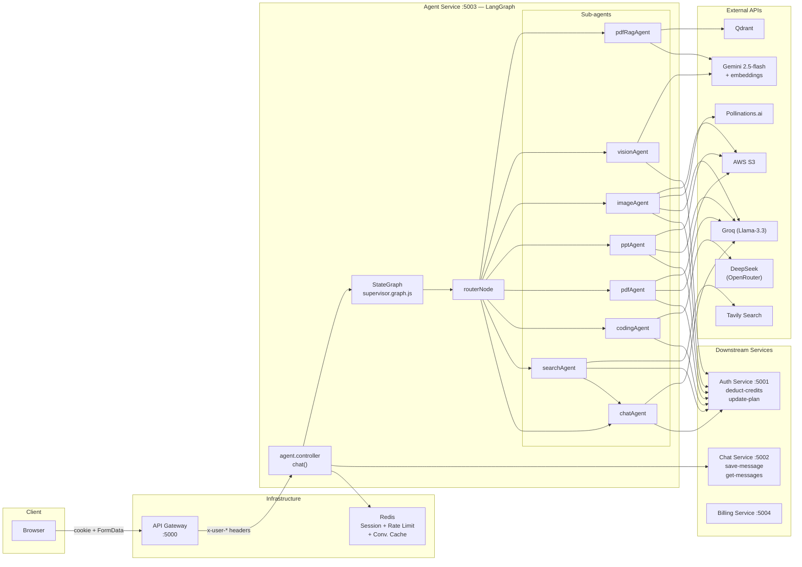
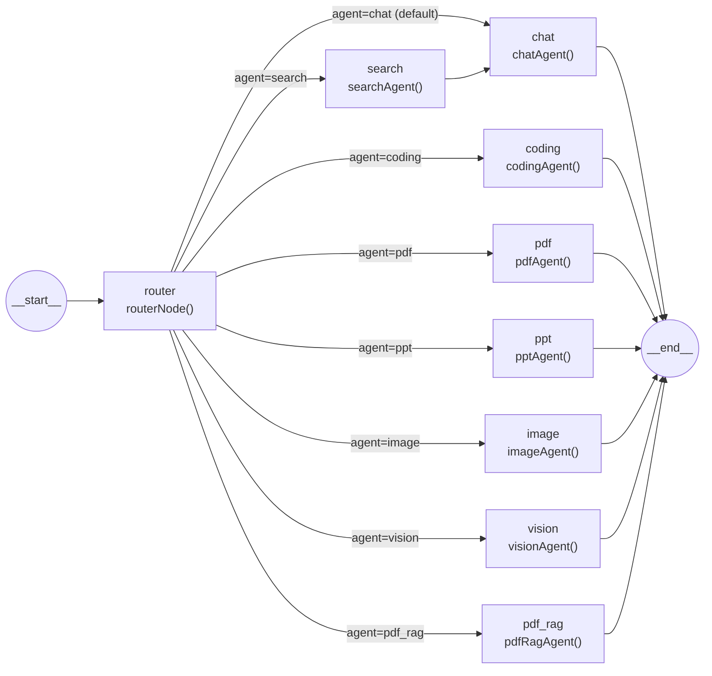

# Agent Orchestration — How the System Coordinates

This document traces how the different services and sub-agents coordinate during an end-to-end request. CortexAI does not use a message queue or event bus — all inter-service communication is synchronous HTTP. The orchestration logic lives inside the LangGraph `StateGraph` within the agent service.

---

## Orchestration Architecture



---

## Communication Protocols

| From | To | Protocol | Auth mechanism |
|------|----|----------|---------------|
| Browser | Gateway | HTTP + `session` cookie | HttpOnly cookie |
| Gateway | Auth Service | HTTP reverse proxy | None (auth route only) |
| Gateway | Chat / Agent / Billing | HTTP reverse proxy | `x-user-id`, `x-user-email`, `x-user-avatar` headers |
| Agent Service | Chat Service | HTTP `axios` (direct, no gateway) | None |
| Agent Service | Auth Service | HTTP `axios` (direct, no gateway) | None |
| Billing Service | Auth Service | HTTP `axios` (direct, no gateway) | None |
| Agent Service | External LLMs | HTTPS (SDK) | API key in env |
| Agent Service | Tavily | HTTPS (SDK) | API key in env |
| Agent Service | Pollinations.ai | HTTPS (`axios`) | None (free API) |
| Agent Service | AWS S3 | HTTPS (SDK) | IAM credentials in env |
| Agent Service | Qdrant | HTTPS (SDK) | API key in env |

---

## End-to-End Trace: "Search the web for latest AI news" (Search → Chat pipeline)

This is the most complex agent path because it involves two sequential agents.

### 1. Browser → Gateway

```
POST http://localhost:5000/api/agent/chat
Content-Type: multipart/form-data
Cookie: session=<uuid>

Body:
  prompt      = "Search the web for latest AI news"
  conversationId = "64abc..."
  agent       = "auto"
```

### 2. Gateway — Session Validation

`protect` middleware:
```
redis.get("session:<uuid>")
→ { userId: "64abc...", email: "user@gmail.com", avatar: "...", plan: "free", credits: 95 }
```
Attaches to `req.user`.

`proxyWithUser` adds headers:
```
x-user-id:     64abc...
x-user-email:  user@gmail.com
x-user-avatar: https://...googleusercontent.com/...
```

Proxies to `http://localhost:5003/chat`.

### 3. Agent Service — Controller (`agent.controller.js`)

```javascript
const { prompt, conversationId, agent } = req.body;
// prompt = "Search the web for latest AI news"
// agent  = "auto"
```

**Step 3a: Save user message to Redis + Chat Service (parallel mental model, sequential in code)**

```javascript
await addMessage(conversationId, "user", prompt);
// redis.set("conversation:64abc...", JSON([..., { role:"user", content:prompt }]), EX 86400)
```

```javascript
await axios.post(`${CHAT_SERVICE}/save-message`, {
  conversationId,
  role: "user",
  content: prompt
});
// MongoDB: Message.create({ conversationId, role:"user", content:prompt })
```

**Step 3b: Invoke LangGraph**

```javascript
const result = await graph.invoke({
  prompt:         "Search the web for latest AI news",
  conversationId: "64abc...",
  userId:         "64abc...",
  agent:          "auto",
  file:           undefined
});
```

### 4. LangGraph — `routerNode` (`router.node.js`)

Evaluation:
1. `state.agent` is `"auto"` → not a bypass.
2. `state.file` is undefined → no file detection.
3. Auto mode → call LLM:

```
Prompt sent to Groq (Llama-3.3):
"You are an agent router.
...
User Query: Search the web for latest AI news"
```

LLM returns: `"search"`

State updated: `{ ...state, agent: "search" }`

### 5. Conditional edge → `searchAgent`

Conditional edge reads `state.agent === "search"` → routes to the `search` node.

### 6. `searchAgent` (`search.agent.js`)

**Step 6a: Rate limit check**
```javascript
await checkAgentLimit(userId, "search");
// redis.incr("rate:search:64abc...") → count=1
// redis.expire("rate:search:64abc...", 60)
// remaining: 4 of 5 per minute
```

**Step 6b: Credit deduction**
```javascript
await deductCredits(userId, "search");
// axios.patch("http://localhost:5001/internal/deduct-credits", { userId, agent:"search" })
```

Auth service receives this call:
- `User.findById(userId)` → user has 95 credits
- COST["search"] = 5
- `user.credits = 95 - 5 = 90`
- `user.save()`
- Looks up `redis.get("user-session:{userId}")` → session UUID
- `redis.set("session:<uuid>", JSON({ ...user, credits: 90 }), EX 604800)` — session updated

**Step 6c: Tavily search**
```javascript
const results = await searchTool.invoke({ query: "Search the web for latest AI news" });
// TavilySearch: maxResults:5, includeImages:true
// Returns: { results:[...], images:[url1, url2, ...] }
```

Returns state update: `{ ...state, searchResults: results }`

### 7. Edge: `search → chat` (not `__end__`)

The graph routes to `chatAgent` next (not to `__end__`).

### 8. `chatAgent` (`chat.agent.js`)

**Step 8a: Rate limit + credit deduction (1 credit)**
```javascript
await checkAgentLimit(userId, "chat");
await deductCredits(userId, "chat");
// user.credits: 90 - 1 = 89
```

**Step 8b: Load conversation memory**
```javascript
const history = await getMemory(conversationId);
// redis.get("conversation:64abc...") → cached history array
```

**Step 8c: Build messages with search context**

Since `state.searchResults` is set:
```javascript
const searchContext = `
Web Search Results:
${state.searchResults}
Answer the user using only the above search results.
`
```

Messages array:
```
[
  SystemMessage("You are CortexAI ... " + searchContext),
  HumanMessage("...previous turn 1..."),
  AIMessage("...previous turn 1 response..."),
  HumanMessage("Search the web for latest AI news")
]
```

**Step 8d: LLM call**
```javascript
const response = await llm.invoke(messages);
// llm = Groq llama-3.3-70b-versatile
```

Returns: `{ response: response.content, images: state.searchResults?.images || [] }`

### 9. LangGraph → Controller: Result

`graph.invoke()` resolves with the final state:
```javascript
{
  prompt: "Search the web for latest AI news",
  conversationId: "64abc...",
  userId: "64abc...",
  agent: "chat",
  response: "Here's the latest in AI:\n\n## OpenAI Releases...",
  images: ["https://...image1.jpg", "..."],
  searchResults: { results:[...], images:[...] },
  artifacts: []
}
```

### 10. Controller: Post-processing

**Step 10a: Save assistant message to Redis + Chat Service**
```javascript
await addMessage(conversationId, "assistant", result.response);
// Redis conversation cache updated

await axios.post(`${CHAT_SERVICE}/save-message`, {
  conversationId,
  role: "assistant",
  content: result.response,
  images: result.images,
  artifacts: []
});
// MongoDB: Message.create({ ..., images:["https://..."], artifacts:[] })
```

**Step 10b: HTTP response to gateway**
```javascript
return res.json({
  success: true,
  answer: result.response,
  images: result.images,
  artifacts: []
});
```

### 11. Gateway → Browser

Gateway proxies the JSON response to the browser.

### 12. Frontend: Redux updates

```javascript
dispatch(addMessage({ role: "assistant", content: data.answer, images: data.images }));
dispatch(setIsLoading(false));
// ArtifactPanel: artifacts is empty → panel stays hidden
// MessageBubble: renders markdown response + images
```

---

## LangGraph Graph Shape



**Key point:** Only `search` has a multi-step path (`router → search → chat → end`). All other agents terminate directly. There are no loops.

---

## Message/Data Formats Between Agents (via LangGraph State)

The "message format" between sub-agents is the `AgentState` object, mutated in-place across node transitions:

| Field | Set by | Read by |
|-------|--------|---------|
| `prompt` | Controller | routerNode, all agents |
| `userId` | Controller | All agents (for rate limit + deduction) |
| `conversationId` | Controller | Controller, chatAgent (for memory) |
| `agent` | routerNode | Conditional edge, chatAgent |
| `file` | Controller | routerNode, visionAgent, pdfRagAgent |
| `searchResults` | searchAgent | chatAgent (to build searchContext) |
| `response` | Each agent | Controller (returned to browser) |
| `images` | chatAgent (from searchResults) | Controller |
| `artifacts` | codingAgent | Controller |

---

## Internal HTTP Call Summary

All inter-service calls are synchronous `axios` calls. There is no retry logic or circuit breaker.

| From | To | Endpoint | When | Payload |
|------|----|---------|------|---------|
| Agent Service | Chat Service | `POST /save-message` | Before LLM call (user msg) | `{ conversationId, role:"user", content }` |
| Agent Service | Chat Service | `POST /save-message` | After LLM call (assistant msg) | `{ conversationId, role:"assistant", content, images, artifacts }` |
| Agent Service | Chat Service | `GET /get-messages/:id` | Memory cache miss | — |
| Agent Service | Auth Service | `PATCH /internal/deduct-credits` | Before LLM call | `{ userId, agent }` |
| Billing Service | Auth Service | `PATCH /internal/update-plan` | After payment verified | `{ userId, plan, credits }` |

---

## Gotchas / Things to Know

- **No async/event-driven coordination.** Every `graph.invoke()` blocks the HTTP request-response cycle. For slow operations (PPT generation, coding), the browser waits with no progress updates. A WebSocket or Server-Sent Events layer would be needed for streaming.
- **Two credits are deducted on a search query** — `searchAgent` deducts 5 credits, then `chatAgent` deducts 1 more credit (total: 6). Users selecting the "Search" agent explicitly pay for both legs.
- **No retry or fallback if an internal HTTP call fails.** If `AUTH_SERVICE/internal/deduct-credits` is down, the error propagates up as a 500 with no retry attempt. If `CHAT_SERVICE/save-message` fails after the LLM has already responded, the response is still returned to the browser but the message is lost from history.
- **The LangGraph graph is compiled once at startup** (`supervisor.graph.js` line 182: `export const graph = workflow.compile()`). There is no per-request graph instantiation; the compiled graph is shared across all concurrent requests. LangGraph's `StateGraph` should be stateless across runs (state is passed as arguments), but this is worth verifying if concurrency bugs arise.
- **`pdfRagAgent` is effectively free and unmetered** — no `checkAgentLimit` or `deductCredits` call is made (see `06-agent-service.md` for details).
- **The router LLM classification adds latency to every "auto" request.** Even a simple chat message incurs one Groq API call for routing before the actual chat call. For low-latency scenarios, the frontend should always pass an explicit agent rather than `"auto"`.
- **There is no health check mechanism between services.** If the auth service is down, every agent call will fail at the deduction step. There are no circuit breakers, timeouts, or fallback behaviors configured on the `axios` instances.
